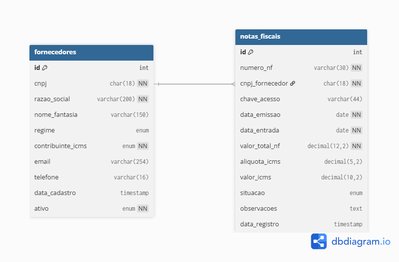

# 📊 ICMS Control System

> **Note:** This project uses **synthetic data** (fictional CNPJs and values) generated for simulation purposes only. No real fiscal data is stored.

This project focuses on the development of a relational database structure designed to handle fiscal data, specifically focusing on invoice management and ICMS tax calculations. 

The goal is to simulate a real-world fiscal environment, managing suppliers and automating the calculation of tax credits and liabilities based on normalized data modeling.

In this project, you will find advanced SQL queries for financial reporting, and strict business rules applied through database constraints.

## 🛠️ Technologies
* **Database:** MySQL 8.0
* **Language:** SQL (DDL, DML, DQL)
* **Tool:** MySQL Workbench
* **Version Control:** Git & GitHub

## 📁 Project Structure

```sh
icms-control/
├── docs/           # Technical documentation (diagrams and references)
├── sql/            # Source code for Database (DDL scripts 01, 02, 03)
├── screenshots/    # Evidence of execution and database schemas
└── README.md       # Project documentation
```

## 🧩 Database Diagram

This diagram represents the current relational model (suppliers and invoices) used in the project.



## Project Initialization

### Step by Step

Clone the project by executing:

```sh
git clone [https://github.com/SEU_USUARIO/icms-control.git]
```
Access the project folder:

```sh
cd icms-control
```
### Database Setup
To set up the database environment, run the scripts in order:

1. **Create Database:** `sql/01-create-database.sql`
2. **Create Suppliers Table:** `sql/02-create-table-fornecedores.sql`
3. **Create Invoices Table:** `sql/03-create-table-notas_fiscais.sql`
4. **Add Foreign Key:** `sql/08-add-FK-notas_fornecedores.sql`
5. **Insert Suppliers:** `sql/05-insert-fornecedores.sql`
6. **Insert Invoices:** `sql/06-insert-notas_fiscais.sql`

📊 SQL Features & Analysis
The project includes several analytical queries to provide business insights:

Total ICMS Credit: Calculation per supplier for tax reconciliation.

Supplier Ranking: Identification of top partners by purchase volume.

Monthly Summary: Consolidation of tax entries and average rates.

Aging Report: Tracking pending invoices and delay days.

👨‍💻 Author
Edinor de Souza Neto - [LinkedIn](https://www.linkedin.com/in/edinor-de-souza-neto/)